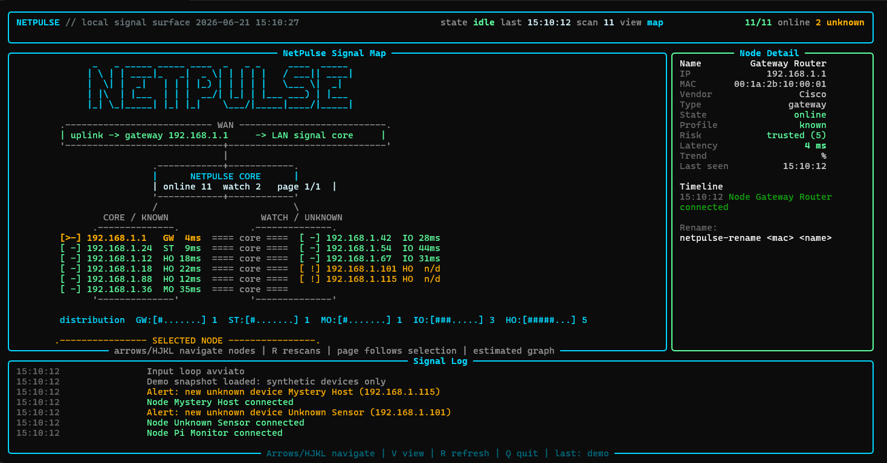

<div align="center">
  
  <p><strong>Local network discovery, presence monitoring, and signal mapping in your terminal.</strong></p>
</div>

# NetPulse

NetPulse is a Python CLI/TUI for discovering, inspecting, and visualizing devices on a local network. It uses `asyncio` for non-blocking scans and `Rich` for a terminal dashboard with a strong visual identity.



## Highlights

- ARP-first discovery with optional deep subnet scans.
- Interactive Rich dashboard with table, card, and signal-map views.
- Local-only device intelligence for vendor, type, risk, and known-device status.
- SQLite history for snapshots, latency metrics, events, alerts, and timelines.
- Screenshot-safe demo mode with synthetic devices and no real network scan.

## Quick Start

```powershell
python -m venv .venv
.\.venv\Scripts\Activate.ps1
python -m pip install -e .
netpulse 192.168.1.0/24
```

Preview the dashboard with synthetic data:

```powershell
netpulse 192.168.1.0/24 --demo
```

## Project Structure

```text
NetPulse/
  pyproject.toml
  README.md
  src/netpulse/
    cli.py          # CLI entrypoint and runtime wiring
    models.py       # shared dataclasses
    network.py      # Network Engine: async ping + ARP table discovery
    persistence.py  # JSON registry for MAC -> friendly name
    state.py        # runtime state, selection, events, timelines
    intelligence.py # local vendor/type/risk classification
    storage.py      # SQLite history, metrics, and event storage
    input.py        # interactive keyboard handling
    rename.py       # helper command for friendly device names
    ui.py           # Rich dashboard and visual rendering
```

## Installation

```powershell
python -m venv .venv
.\.venv\Scripts\Activate.ps1
python -m pip install -e .
```

## Usage

```powershell
netpulse 192.168.1.0/24 --timeout 1
```

By default, NetPulse uses **manual dashboard mode**:

- it loads an initial ARP snapshot;
- it stays stable and navigable;
- it refreshes only when you press `R`.

This keeps the ASCII map readable and avoids constant layout movement.

For continuous monitoring:

```powershell
netpulse 192.168.1.0/24 --watch --interval 5
```

For screenshots or demos without scanning your real network:

```powershell
netpulse 192.168.1.0/24 --demo
```

For a deeper subnet scan:

```powershell
netpulse 192.168.1.0/24 --deep-scan
```

For reverse-DNS hostname resolution:

```powershell
netpulse 192.168.1.0/24 --resolve-names
```

Note: `--resolve-names` can be slow on Windows if the network does not answer reverse DNS queries quickly.

## Dashboard

The dashboard includes:

- a status header with time, view, scan state, and online counts;
- a compact device table;
- device cards;
- an estimated ASCII-art network map;
- a selected-node detail panel;
- a fixed-height signal log.

Interactive controls:

- `Arrows` or `H/J/K/L`: move the selected device;
- `V`: switch between table, map, and cards;
- `R`: run a manual refresh;
- `Q`: quit.

In table view, up/down moves one device at a time. In card view, up/down follows the grid.

If direct key input is unreliable in your terminal, use:

```powershell
netpulse 192.168.1.0/24 --line-input
```

Then type commands followed by Enter: `j`, `k`, `v`, `r`, `q`.

## Device Intelligence

NetPulse enriches each device with local-only intelligence:

- vendor estimate from MAC/OUI prefixes;
- estimated type: `gateway`, `host`, `mobile`, `storage`, `iot`;
- risk label: `trusted`, `unknown`, `watch`;
- numeric risk score.

The classification is conservative and local. It uses hostname hints, known OUI prefixes, MAC presence, and the estimated gateway.

## Network Map

The map is the visual centerpiece of NetPulse.

It is not meant to be a perfect physical topology. Instead, it creates an estimated signal map from the scan data:

- WAN/uplink;
- detected or estimated gateway;
- NetPulse LAN core;
- left/right clusters;
- node chips with status markers;
- distribution bars by device type;
- selected node focus.

Markers:

- `>` selected node;
- `!` unknown/watch node;
- `x` offline node;
- `-` trusted/normal node.

The map order is weighted to surface infrastructure and trusted devices first, then unknown/watch devices, then offline devices. The visible page follows the selected node.

## Visual Identity

NetPulse uses a focused terminal palette:

- electric cyan for structure, links, and primary surfaces;
- pulse green for online/trusted state;
- amber for selection, unknown, and watch states;
- hot red for offline or error states.

The goal is to make the tool feel like a local network command center rather than a plain scanner.

## History And Timeline

NetPulse stores runtime history in `netpulse.db`:

- device snapshots;
- latency metrics;
- connection/disconnection events;
- alerts;
- per-device timeline events.

You can choose a different history database:

```powershell
netpulse 192.168.1.0/24 --history lan-history.db
```

By default, NetPulse keeps all stored metrics and events. To prune old runtime
history on startup, set a retention window:

```powershell
netpulse 192.168.1.0/24 --watch --retention-days 30
```

## Friendly Names

NetPulse uses `devices.json` to associate friendly names with MAC addresses:

```json
{
  "devices": {
    "aa:bb:cc:dd:ee:ff": {
      "name": "Studio Laptop"
    },
    "11:22:33:44:55:66": {
      "name": "NAS"
    }
  }
}
```

You can rename a device from the CLI:

```powershell
netpulse-rename aa:bb:cc:dd:ee:ff "Studio Laptop"
```

On the next scan, the device will use the friendly name instead of the fallback `Host <ip>`.

## Diagnostics

Run one scan without the live dashboard:

```powershell
netpulse 192.168.1.0/24 --once
```

Show only ARP-cache devices:

```powershell
netpulse 192.168.1.0/24 --once --arp-only
```

Use plain text output:

```powershell
netpulse 192.168.1.0/24 --once --plain
```

Print discovery diagnostics:

```powershell
netpulse 192.168.1.0/24 --diag
```

Test keyboard input:

```powershell
netpulse 192.168.1.0/24 --key-test
```

## Development

Run the unit tests with the project virtual environment:

```powershell
.\.venv\Scripts\python.exe -B -m unittest discover -v
```

If you want to run a full bytecode compilation check on Windows/OneDrive,
write Python's cache outside the project directory:

```powershell
$env:PYTHONPYCACHEPREFIX = Join-Path $env:TEMP 'netpulse-pycache'
.\.venv\Scripts\python.exe -m compileall src tests
```
